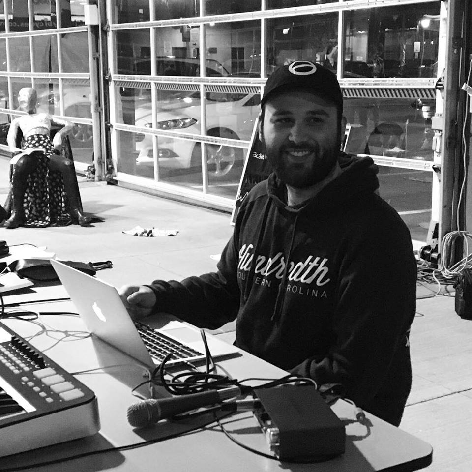
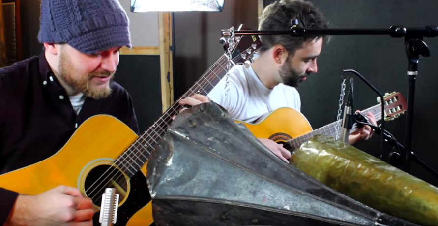
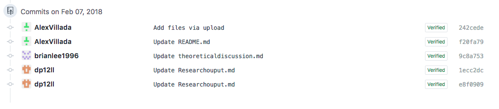

# IASC 2P02 // Alex Villada

## Bio

My name is Alex Villada and I am a second year student in the IASC program at Brock University. My research area revolves around text analysis, and my research program involves doing analytical and problem solving tasks with text analysis tools. This research focus is reflected in my academic projects, that I have included in this portfolio, such as a project that looks at collaborative research contribution as well as a solo research development. similarly, my academic blog looks at an analysis of comparing different authors’ contextual meanings in the Digital Humanities department. I'd like to continue with this work in the future by doing research revolving different forms of media communication, as well as contemporary technology. Contemporary technology is always ever growing, and there are always new obstacles, and blockades that come and stagger research, being able to overcome those obstacles, is a great learning experience, builds skill set and requires patience and perseverance. An example of this would be my academic blog, as well as solo research presentation, as I’ve had many changes and process changes when compiling them together. With that being said, I’d like to continue in this field as a data analyst and problem solver with contemporary and future technology.

## Featured Project: (Wax Cylinder Phonograph)

This is a solo presentation I’ve compiled. The guidelines specified that we needed to compile a Pecha Kucha presentation, which if you aren’t familiar with the format, the presentation consists of 20 slides, and they advance every 20 seconds, which translates to an exact 5 minute presentation. The topic of choice I decided to talk about was a forgotten sound recording technique with wax cylinders. In this presentation, I touch base on the origin, how the mechanism worked, the peripherals used, and overall basic information. Later in the presentation, I talk about what the technology means today and how it’s evolved. I mention that microphones are the current day equivalent, however, there was a recent case where famous Youtube creator Rob Scallon, experimented with this 100 year old technology, in current day conditions and applications. Going back to my presentation, I’ve also touched base with MIDI notes, and how MIDI, and these wax cylinders, bare very similar resemblances. My overall basis of this research presentation was to talk about how media archeology between an old piece of technology and the current day equivalent, and the common techniques and similarities, and It’s interesting to see how things have evolved overtime.  

The research for this project changed a lot overtime. At the beginning, I wanted to solely talk about the old tech, and the new. I started off by doing research on the wax cylinder, as well as the peripheral used for recording sound into the cylinder, and finally, how the entire process works, and the applications. It was a bit difficult to find information that would be useful to use, however I then got to a point where I had so much information to use, I didn’t know what to include, and what to cut. As I’ve progressed with gathering the information, I decided to divide the presentation in 2 different sections. Starting off with the section for the past piece of technology, which is the wax cylinder device, and the future, which is now the present, being microphones, DAWs (Digital Audio Workstations), audio interfaces, and more. My final presentation had a few pieces of instructor feedback. One, my original presentation had too many lines of text. With it being a timed presentation, and having 20 seconds per slide, I was having a bit of a struggle with getting all of my ideas out when presenting. With that being said, I scaled back my slides, and added more pictures, instead of lines of text, which would be too script-like. Another piece of feedback I’ve been given was that there was a bit of a loss of translation, at the beginning of the presentation, with the talk of the history of the Wax Cylinder. This might’ve been because of the amount of information  i tried to convey, and again, I scaled it back, wanting to be more simple, yet effective, and not overwhelming.

During the process of making my presentation, I made multiple changes that illustrate my different ideas flourishing, which again might’ve gotten a bit messy. The first edit I’ve included shows the process of me trying to get a gif link to work in the presentation slides. I had a bit of an issue getting the proper link, and linking it properly to show up the way I’d like it to was an issue, as there are so many kinds of links to share images and gifs, which you can see [here](https://github.com/AlexVillada/IASC-2P02/commit/cb547a874c6bcc10496c04793a7864ae7ae558c9#diff-abdf882c25e08d9ba219fe33f17591fe).The next change I will be showing also shows a change and process, but instead, this is one about the color of the slides. This may be a small detail, however the color of the presentation definitely helps with the overall impression and mood. A vibrant red would not fit the tone, and would be fairly distracting, with the attention going on the focus of the color, rather than the slides and the content that is being presented. Teal wasn’t very helpful, and I had a couple of other color changes, but I later decided to settle for a neutral black. Which you can see [here](https://github.com/AlexVillada/IASC-2P02/commit/45458c7096da2aac039da778cb89204bdebf93d8#diff-abdf882c25e08d9ba219fe33f17591fe). This last change illustrates the change in how I presented the information that I had at my disposal. I originally had a lot more text on my slides, which as you know, isn’t the best format for a presentation like this. I cut back a lot of the information, giving the main points, and kept what was needed, to try and optimize the use of the slide. An example of that is [here](https://github.com/AlexVillada/IASC-2P02/commit/d772ec3be86caadb949c53333ed35fc608a19fd5#diff-abdf882c25e08d9ba219fe33f17591fe). 

Read [Wax Cylinder Phonograph](blog)

Overall these changes show the process of what I felt would work best in this presentation format with the time restraints, as well as my change in vocabulary choice and optimizing the space needed for each slide according to the information.

## Collaborative Pesentation

This collaborative presentation was a task that revolved me and my peers to work together, to give a collaborative presentation on a tool that would benefit an individual who does research in the Digital Humanities field. The tool that me and my group decided to take a look at, was Zotero. We were required to talk about Zotero in different ways, such as giving notable information about the tool such as what it is, who created it, as well as when and where they created it. Other information includes how it is funded, it’s features and main goals. We were also required to talk about our research findings, this includes giving an thesis and an argument on what this tool is used for and how it benefits said use, and how we gathered the information, presented it, and what we felt was needed to be mentioned and what wasn’t. Lastly, we had a section on theoretical discussion, which was about us talking about the theoretical meaning and intention behind it. Things such as how it relates to DH, and how we used the tool GitHub to compile our information together.

As a group, we had a lot of ideas flowing. Each of us took different roles, and I was in change of theoretical discussion, with my peer, Brian. My peer Evan was in charge of the basic initial information, and our other member Dylan, was in charge of the research findings. Brian and I were focusing on talking about other DH researchers and we were talking about how these tools would benefit said researchers. Overall, as a group, we had a lot of ideas going back and forth. It’s great to work as a group in this field especially, as there are a lot of analytical discussions I can find myself into regarding technology. In this group collaboration specifically, I learned things from my peers Dylan, Evan and Brian. Everyone has something to offer in the group and I feel it was compiled nicely into one collaborative piece. With that being said, since I’ve been engaged in this environment with a group, I’ve been able to enforce my research skills, and find information more effectively, as shown on the solo research presentation. 

Here are 3 piece of commits that I have been apart of. *Brian submit the commits, I worked on material and sent it to him*

(available [here](https://github.com/IascAtBrock/IASC-2P02-TeamPresentations/commit/ec1b9cb5f74ec8272749826f964ae5adfe146bb1#diff-263c9d16322b91363cd286714e70dc9f)).

(available [here](https://github.com/IascAtBrock/IASC-2P02-TeamPresentations/commit/15f6d5539423d1b91035ae42ac1de7812b8cff58#diff-263c9d16322b91363cd286714e70dc9f)).

## Acedemic Blog

Throughout the years, the field of humanities in post education has been evergrowing, and with recent technological advancements, we’ve been able to delve into a whole new front of DH... [Continue reading](blog)

## Research Presentation
[Click Here](https://alexvillada.github.io/IASC-2P02/reveal/index.html)

## Pop Quiz

What's my favorite Star Wars Movie?
...[Answer](images/star-wars-episode-3-revenge-of-the-sith-poster-4[1].jpg)
